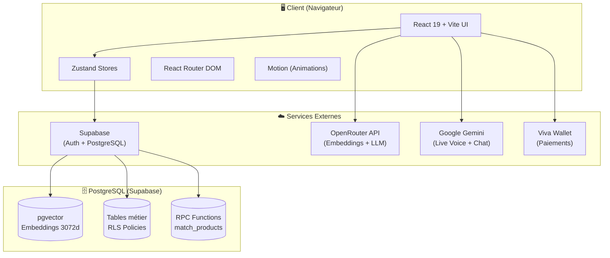

# Architecture Système — Shop-ia

## 🗺 Vue d'ensemble (Data Flow)



### Flux de données typique

```
┌─────────────────────────────────────────────────────────────────┐
│                         REQUÊTE CLIENT                          │
├─────────────────────────────────────────────────────────────────┤
│                                                                 │
│  1. Authentification (JWT)                                       │
│     Client ──▶ Supabase Auth ──▶ auth.users                    │
│                                                                 │
│  2. Requête Données (RLS)                                      │
│     Client ──▶ PostgREST ──▶ PostgreSQL + RLS Policy           │
│                                                                 │
│  3. Recherche IA                                               │
│     Query ──▶ OpenRouter ──▶ Embedding ──▶ pgvector ──▶ Results│
│                                                                 │
│  4. Assistant Conversationnel                                  │
│     Chat ──▶ OpenRouter LLM ──▶ Réponse contextuelle           │
│                                                                 │
│  5. Paiement                                                   │
│     Cart ──▶ Create Order ──▶ Viva Wallet ──▶ Redirection      │
│                                                                 │
└─────────────────────────────────────────────────────────────────┘
```

---

## 🖥 Frontend Architecture

### Stack & Patterns

| Couche | Technologie | Pattern |
|--------|-------------|---------|
| **UI Framework** | React 19.0 | Functional Components + Hooks |
| **Build Tool** | Vite 6.2 | ESM, HMR, Tree-shaking |
| **Styling** | TailwindCSS 4.1 | Utility-first + Custom Design System |
| **Animations** | Motion 12.23 | Declarative animations |
| **Icons** | Lucide React | SVG tree-shakeable |
| **State** | Zustand 5.0 | Atomic stores, no providers |
| **Routing** | React Router 7 | Lazy loading, nested routes |
| **Charts** | Recharts 3.7 | Responsive SVG charts |
| **Markdown** | react-markdown | Rich content rendering |

### Structure des composants

```
src/components/
├── Layout.tsx                 # Layout principal (Header/Footer/Nav)
├── ShopiaAssistant.tsx        # Assistant IA (66KB - core feature)
├── VoiceAdvisor.tsx           # Conseiller vocal temps réel
├── CartSidebar.tsx            # Panier latéral persistant
├── ProductCard.tsx            # Carte produit réutilisable
├── LoyaltyCard.tsx            # Carte de fidélité digitale
├── ReviewCarousel.tsx         # Carrousel d'avis clients
├── BestSellers.tsx            # Section bestsellers
├── SEO.tsx                    # Meta tags dynamiques
├── admin/                     # 31 composants admin
│   ├── AdminDashboardTab.tsx  # Analytics temps réel
│   ├── AdminProductsTab.tsx   # Gestion catalogue
│   ├── AdminOrdersTab.tsx     # Workflow commandes
│   ├── AdminCustomersTab.tsx  # Gestion clients
│   ├── AdminPOSTab.tsx        # Point de vente physique
│   ├── AdminStockTab.tsx      # Gestion des stocks
│   ├── AdminAnalyticsTab.tsx  # Rapports avancés
│   └── ...
└── shopia-assistant-ui/       # UI spécifique assistant
    ├── WelcomeScreen.tsx
    ├── QuizFlow.tsx
    ├── ChatInterface.tsx
    └── ProductRecommendations.tsx
```

### Gestion d'état (Zustand)

```typescript
// Store pattern utilisé
src/store/
├── authStore.ts      # Auth + Profil utilisateur + Sessions
├── cartStore.ts      # Panier + Sync Supabase + Calculs
├── settingsStore.ts  # Configuration boutique
├── toastStore.ts     # Notifications
└── wishlistStore.ts  # Liste de souhaits
```

**Architecture des stores**:
- Pas de providers React (pas de context hell)
- Sélecteurs automatiques (pas de re-renders inutiles)
- Persistence localStorage pour certains stores
- Synchronisation temps réel Supabase Realtime

### Routing

```typescript
// App.tsx - Router configuration
<BrowserRouter>
  <Routes>
    {/* Routes Admin (pas de Layout) */}
    <Route element={<AdminRoute />}>
      <Route path="admin" element={<Admin />} />
      <Route path="pos" element={<POSPage />} />
    </Route>

    {/* Routes Publiques */}
    <Route path="/" element={<Layout />}>
      <Route index element={<Home />} />
      <Route path="catalogue" element={<Catalog />} />
      <Route path="catalogue/:slug" element={<ProductDetail />} />
      {/* ... */}
      
      {/* Routes Protégées */}
      <Route element={<ProtectedRoute />}>
        <Route path="commande" element={<Checkout />} />
        <Route path="compte" element={<Account />} />
        {/* ... */}
      </Route>
    </Route>
  </Routes>
</BrowserRouter>
```

---

## ⚙️ Backend Architecture

### Supabase BaaS Pattern

**Architecture Serverless** - Pas de backend Node/Express dédié.
Les requêtes clientes communiquent directement avec Supabase via:
- **PostgREST** : API REST auto-générée depuis PostgreSQL
- **Realtime** : WebSocket pour les mises à jour temps réel
- **Auth** : JWT-based authentication
- **Storage** : Gestion des fichiers (images produits)

### Sécurité (RLS - Row Level Security)

```sql
-- Pattern RLS utilisé
-- 1. Enable RLS on table
ALTER TABLE orders ENABLE ROW LEVEL SECURITY;

-- 2. Create policy
CREATE POLICY "orders_owner_read" ON orders
FOR SELECT USING (
  user_id = auth.uid() OR 
  public.is_admin()
);
```

**Fonction is_admin()**:
```sql
CREATE FUNCTION public.is_admin()
RETURNS boolean AS $$
  RETURN EXISTS (
    SELECT 1 FROM public.profiles
    WHERE id = auth.uid() AND is_admin = true
  );
END;
$$ LANGUAGE plpgsql SECURITY DEFINER;
```

### Fonctions RPC (PostgreSQL)

```sql
-- Recherche vectorielle sémantique
match_products(query_embedding vector(3072), match_threshold float, match_count int)

-- Synchronisation stock bundles
sync_bundle_stock(p_bundle_id uuid)
trigger_sync_bundles_on_stock_change()

-- Génération referral codes
generate_referral_code()
tr_generate_referral_code()

-- POS Customer creation
create_pos_customer(p_full_name text, p_phone text, p_email text)

-- Admin utilities
admin_get_user_email(p_user_id uuid)
```

---

## 🗄️ Base de données

### Schema relationnel

```
┌─────────────────────────────────────────────────────────────┐
│                    CORE TABLES                              │
├─────────────────────────────────────────────────────────────┤
│                                                             │
│   ┌──────────────┐         ┌──────────────┐                │
│   │  categories  │────────▶│   products   │                │
│   │  (10 rows)   │  1:N    │  (50+ rows)  │                │
│   └──────────────┘         └──────┬───────┘                │
│                                    │                        │
│           ┌────────────────────────┼────────────────┐       │
│           │                        │                │       │
│           ▼                        ▼                ▼       │
│   ┌──────────────┐      ┌──────────────┐   ┌──────────┐  │
│   │ bundle_items  │      │   reviews    │   │stock_mvt │  │
│   │  (bundles)    │      │  (avis)      │   │(history) │  │
│   └──────────────┘      └──────────────┘   └──────────┘  │
│                                                             │
└─────────────────────────────────────────────────────────────┘

┌─────────────────────────────────────────────────────────────┐
│                    USER DOMAIN                              │
├─────────────────────────────────────────────────────────────┤
│                                                             │
│   auth.users (Supabase)                                     │
│        │                                                    │
│        ▼ (trigger)                                         │
│   ┌──────────────┐         ┌──────────────┐                │
│   │   profiles   │────────▶│   addresses  │                │
│   │  (clients)   │  1:N    │  (livraison) │                │
│   └──────┬───────┘         └──────────────┘                │
│          │                                                  │
│          ├──────────▶ ┌──────────────┐                    │
│          │             │    orders    │                    │
│          │             │  (commandes) │                    │
│          │             └──────┬───────┘                    │
│          │                      │                           │
│          │                      ▼                           │
│          │             ┌──────────────┐                    │
│          │             │  order_items │                    │
│          │             │  (détails)   │                    │
│          │             └──────────────┘                    │
│          │                                                  │
│          ├──────────▶ ┌──────────────┐                    │
│          │             │ subscriptions│                    │
│          │             │ (abonnements)│                    │
│          │             └──────────────┘                    │
│          │                                                  │
│          └──────────▶ ┌──────────────┐                    │
│                       │ referrals      │                    │
│                       │ (parrainage)   │                    │
│                       └──────────────┘                    │
│                                                             │
└─────────────────────────────────────────────────────────────┘

┌─────────────────────────────────────────────────────────────┐
│                    AI DOMAIN                                  │
├─────────────────────────────────────────────────────────────┤
│                                                             │
│   ┌──────────────────┐      ┌──────────────────┐            │
│   │user_ai_prefs   │      │assistant_interact│            │
│   │(préférences)   │      │(conversations)   │            │
│   └──────────────────┘      └──────────────────┘            │
│                                                             │
│   products.embedding ◄──── vector(3072)                     │
│                                                             │
└─────────────────────────────────────────────────────────────┘
```

### Tables principales (20 tables)

| Domaine | Tables |
|---------|--------|
| **Catalogue** | `categories`, `products`, `bundle_items`, `product_recommendations` |
| **Utilisateurs** | `profiles`, `addresses`, `user_ai_preferences`, `user_active_sessions` |
| **Commandes** | `orders`, `order_items`, `subscriptions`, `subscription_orders` |
| **Paiement** | `promo_codes`, `pos_reports` |
| **Stock** | `stock_movements` |
| **Fidélité** | `loyalty_transactions`, `referrals` |
| **Avis** | `reviews` |
| **IA** | `assistant_interactions` |
| **Config** | `store_settings` |

---

## 🤖 Services Externes

### OpenRouter (LLM & Embeddings)

```typescript
// Usage dans l'application
const EMBEDDING_MODEL = 'openai/text-embedding-3-small';
const EMBEDDING_DIMENSIONS = 768;

// 1. Generate embedding from query
const embedding = await fetchOpenRouterEmbedding(query);

// 2. Search similar products via Supabase RPC
const { data } = await supabase.rpc('match_products', {
  query_embedding: embedding,
  match_threshold: 0.7,
  match_count: 8
});
```

**Rôle**:
- Convertir les requêtes texte en vecteurs (embeddings)
- Powerer le chat de Shopia Assistant
- Coût optimisé via OpenRouter vs OpenAI direct

### Google Gemini (Live Voice)

```typescript
// WebSocket direct depuis le navigateur
const liveVoice = useGeminiLiveVoice({
  apiKey: import.meta.env.VITE_GEMINI_API_KEY,
  onTranscript: (text) => setUserMessage(text),
  onResponse: (audio) => playAudio(audio)
});
```

**Rôle**:
- Conseiller vocal temps réel (bidirectionnel)
- Streaming audio WebSocket
- Alternative au chat texte

### Viva Wallet (Paiements)

```typescript
// Flow de paiement
const createVivaOrder = async (orderData) => {
  const { orderCode } = await fetch(`${baseUrl}/checkout/v2/orders`, {
    method: 'POST',
    headers: { Authorization: `Bearer ${token}` },
    body: JSON.stringify(orderData)
  });
  return orderCode;
};

// Redirect to Viva payment page
window.location.href = `${baseUrl}/web/checkout?ref=${orderCode}`;
```

---

## 💡 Décisions d'Architecture

### 1. **BaaS Supabase vs Backend Node custom**

**Choix**: Supabase

**Justification**:
- Time-to-market: 10x plus rapide qu'un backend from scratch
- Auth intégrée avec JWT
- RLS natif pour la sécurité
- Realtime subscriptions (WebSocket)
- pgvector pour la recherche sémantique
- Pas de devops à gérer

### 2. **Zustand vs Redux/Context**

**Choix**: Zustand

**Justification**:
- Zero boilerplate (vs Redux)
- Pas de provider hell (vs Context)
- Tree-shakeable et léger
- DevTools integration
- Stores indépendants (atomic design)

### 3. **Recherche Vectorielle vs Full-text SQL**

**Choix**: pgvector + OpenRouter embeddings

**Justification**:
- Recherche sémantique ("produit pour dormir" → CBD indica)
- Pas de maintenance d'index Elasticsearch
- Intégration native PostgreSQL
- Scalabilité verticale Supabase

### 4. **React 19 vs Vue/Svelte**

**Choix**: React 19

**Justification**:
- Concurrent features (Transitions, Suspense)
- Server Components ready
- Écosystème mature (Motion, Recharts)
- Team expertise

### 5. **Monorepo vs Multi-repo**

**Choix**: Single-repo

**Justification**:
- Full-stack dans un seul déploiement Vercel
- Shared types entre frontend et scripts
- CI/CD simplifiée

---

## 🔒 Security Considerations

| Layer | Protection |
|-------|------------|
| **Auth** | JWT from Supabase Auth, auto-refresh |
| **Data** | RLS policies on all tables |
| **API** | No exposed admin keys (client-side only anon key) |
| **Payments** | Viva Wallet hosted pages (PCI compliant) |
| **AI** | API keys server-side only (⚠️ Actuellement client-side - à migrer) |
| **CSP** | Content Security Policy headers (à implémenter) |

---

## 📈 Performance

| Optimisation | Implementation |
|--------------|----------------|
| **Code Splitting** | React.lazy + Suspense per route |
| **Tree Shaking** | Vite ESM, selective imports (lucide-react) |
| **Images** | WebP format, lazy loading, blur placeholder |
| **Caching** | SWR pattern via Zustand + localStorage |
| **Bundle** | ~200KB initial, lazy load admin chunks |
| **Database** | RPC functions, indexed columns, connection pooling |

---

## 🔮 Futurs évolutions envisagées

1. **Edge Functions** : Migrer les appels IA côté serveur (secrets sécurisés)
2. **React Server Components** : Migration partielle pour le catalogue
3. **PWA** : Service Worker pour offline cart
4. **Multi-tenancy** : Architecture SaaS pour plusieurs boutiques
5. **GraphQL** : Alternative à REST si complexité croissante

---

<p align="center">
  Architecture documentée le 8 mars 2026 | Shop-ia v0.0.0
</p>
