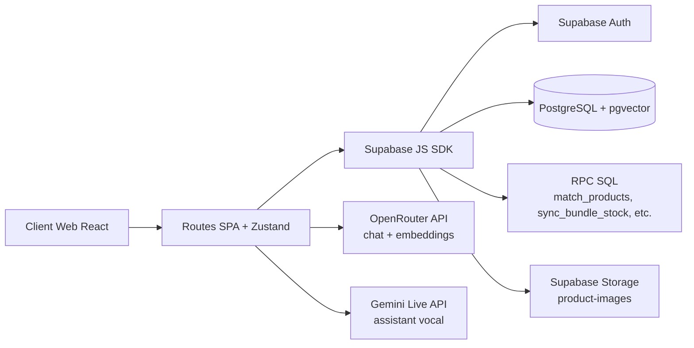

# ARCHITECTURE

## Vue d'ensemble

> ⚠️ À compléter : aucun backend Node/Express n'est utilisé en runtime applicatif malgré la présence de dépendances `express`/`better-sqlite3` dans `package.json`.

## Frontend
- Architecture SPA React 19 + TypeScript, bootstrappée par Vite.
- Routing centralisé dans `src/App.tsx` avec lazy-loading des pages (`React.lazy` + `Suspense`).
- Deux gardes d'accès :
  - `ProtectedRoute` pour les routes authentifiées (compte, checkout).
  - `AdminRoute` pour admin + POS.
- État global via Zustand :
  - `authStore`, `cartStore`, `wishlistStore`, `settingsStore`, `toastStore`.
- Intégration IA côté client via hooks dédiés :
  - `useShopiaAssistantChat`, `useGeminiLiveVoice`, `useShopiaAssistantMemory`, `useShopiaAssistantQuiz`.

## Backend / API
- Modèle backend principal : **BaaS Supabase**.
- Accès données via `@supabase/supabase-js` depuis le frontend.
- Couche métier SQL côté base : fonctions RPC et triggers dans `supabase/init_database.sql`.
- Authentification : Supabase Auth (email/password, reset password, update user).
- Autorisation : RLS active sur toutes les tables + helper SQL `public.is_admin()`.
- Stockage de médias : bucket public `product-images` avec policies d'écriture admin.

## Base de données
- Base relationnelle PostgreSQL (Supabase), extension `vector` activée.
- Tables métier e-commerce + compte client + IA + POS.
- Migrations : projet orienté script SQL consolidé (`supabase/init_database.sql`) + scripts correctifs (`rescue_assistant_table.sql`, `fix_rls.js`, etc.).
- Recherche sémantique produits via `products.embedding vector(3072)` + RPC `match_products`.

## Services externes
- **OpenRouter API** : génération texte assistant + embeddings produits/requêtes.
- **Gemini Live API** : assistant vocal temps réel dans le navigateur.
- **Viva Wallet** : variables de config présentes ; intégration de paiement partiellement préparée côté frontend.

## Décisions d'architecture
- **Supabase-first** pour accélérer le delivery : auth, DB, storage et sécurité RLS dans une même plateforme.
- **Frontend riche (SPA)** pour UX rapide, navigation fluide et POS intégré sans multiplier les services.
- **Zustand** pour un état global léger, simple à maintenir, sans boilerplate lourd.
- **Fonctions SQL RPC** pour déplacer les opérations sensibles/proches de la donnée (promos, bundles, recherche vectorielle, clients POS).
- **IA hybride** (OpenRouter + Gemini Live) pour séparer les usages texte et voix, et permettre des optimisations indépendantes.
