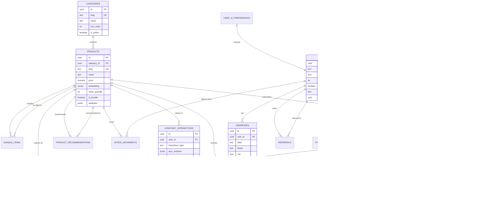

# Schéma de Base de Données — Shop-ia

> Documentation complète du schéma PostgreSQL avec Supabase. 20 tables, relations, indexes et RLS policies.

---

## 📋 Table des matières

- [Vue d'ensemble](#vue-densemble)
- [Tables Core (Catalogue)](#tables-core-catalogue)
- [Tables Utilisateurs](#tables-utilisateurs)
- [Tables Commandes](#tables-commandes)
- [Tables Fidélité](#tables-fidélité)
- [Tables IA & Analytics](#tables-ia--analytics)
- [Tables Admin & Config](#tables-admin--config)
- [Fonctions & Triggers](#fonctions--triggers)
- [RLS Policies](#rls-policies)
- [Diagramme ERD](#diagramme-erd)

---

## Vue d'ensemble

| Information | Valeur |
|-------------|--------|
| **Database** | PostgreSQL 15+ (Supabase) |
| **Tables** | 20 |
| **Extensions** | `vector` (pgvector), `pgcrypto` |
| **RLS Enabled** | ✅ Toutes les tables métier |
| **Vector Dimensions** | 3072 (products.embedding) |

### Légende des colonnes

| Abréviation | Signification |
|-------------|---------------|
| `PK` | Primary Key |
| `FK` | Foreign Key |
| `UQ` | Unique |
| `NN` | Not Null |
| `DEF` | Default value |
| `IDX` | Index |

---

## Tables Core (Catalogue)

### `categories`

Catégories de produits hiérarchisées.

| Colonne | Type | Contraintes | Description |
|---------|------|-------------|-------------|
| `id` | `uuid` | `PK`, `DEF: gen_random_uuid()` | Identifiant unique |
| `slug` | `text` | `UQ`, `NN` | URL-friendly identifier |
| `name` | `text` | `NN` | Nom affiché |
| `description` | `text` | - | Description HTML/markdown |
| `icon_name` | `text` | - | Nom icône Lucide |
| `image_url` | `text` | - | URL image de la catégorie |
| `sort_order` | `integer` | `DEF: 0` | Ordre d'affichage |
| `is_active` | `boolean` | `DEF: true` | Visible sur le site |
| `created_at` | `timestamptz` | `DEF: now()` | Date de création |

**Indexes**: `idx_categories_slug`, `idx_categories_sort_order`

**RLS**: Lecture publique, écriture admin

---

### `products`

Catalogue produits avec embeddings vectoriels.

| Colonne | Type | Contraintes | Description |
|---------|------|-------------|-------------|
| `id` | `uuid` | `PK`, `DEF: gen_random_uuid()` | Identifiant unique |
| `category_id` | `uuid` | `FK → categories.id`, `NN` | Catégorie parente |
| `slug` | `text` | `UQ`, `NN` | URL-friendly |
| `name` | `text` | `NN` | Nom du produit |
| `description` | `text` | - | Description détaillée |
| `nutriscore` | `text` | - | Score nutritionnel A-E |
| `weight_info` | `text` | - | Info poids affichée |
| `weight_grams` | `numeric(8,2)` | - | Poids en grammes |
| `price` | `numeric(10,2)` | `NN` | Prix TTC |
| `original_value` | `numeric(10,2)` | - | Valeur totale (pour bundles) |
| `image_url` | `text` | - | Image principale |
| `stock_quantity` | `integer` | `DEF: 0` | Stock disponible |
| `is_available` | `boolean` | `DEF: true` | En vente |
| `is_featured` | `boolean` | `DEF: false` | Mis en avant |
| `is_active` | `boolean` | `DEF: true` | Actif en BDD |
| `is_bundle` | `boolean` | `DEF: false` | Est un pack/combo |
| `is_subscribable` | `boolean` | `DEF: false` | Disponible en abonnement |
| `attributes` | `jsonb` | `DEF: '{}'` | Arômes, effets, etc. |
| `sku` | `text` | `UQ` | Référence interne |
| `embedding` | `vector(3072)` | - | Vecteur sémantique IA |
| `created_at` | `timestamptz` | `DEF: now()` | Date de création |

**Indexes**: `idx_products_sku`, `idx_products_category`, `idx_products_embedding` (IVFFlat)

**RLS**: Lecture publique, écriture admin

---

### `bundle_items`

Association produits pour les packs/bundles.

| Colonne | Type | Contraintes | Description |
|---------|------|-------------|-------------|
| `id` | `uuid` | `PK`, `DEF: gen_random_uuid()` | Identifiant |
| `bundle_id` | `uuid` | `FK → products.id`, `NN` | Produit pack parent |
| `product_id` | `uuid` | `FK → products.id`, `NN` | Produit inclus |
| `quantity` | `integer` | `DEF: 1`, `CHECK > 0` | Quantité dans le pack |
| `created_at` | `timestamptz` | `DEF: now()` | Date création |

**Contrainte**: `UQ(bundle_id, product_id)` - Pas de doublon

**RLS**: Hérite des policies products

---

### `product_recommendations`

Recommandations cross-sell manuelles + fallback auto.

| Colonne | Type | Contraintes | Description |
|---------|------|-------------|-------------|
| `id` | `uuid` | `PK`, `DEF: gen_random_uuid()` | Identifiant |
| `product_id` | `uuid` | `FK → products.id`, `NN` | Produit source |
| `recommended_id` | `uuid` | `FK → products.id`, `NN` | Produit recommandé |
| `sort_order` | `integer` | `DEF: 0` | Ordre d'affichage |
| `created_at` | `timestamptz` | `DEF: now()` | Date création |

**Contraintes**: `UQ(product_id, recommended_id)`, `CHECK(product_id <> recommended_id)`

**RLS**: Lecture publique, écriture admin

---

## Tables Utilisateurs

### `profiles`

Profils utilisateurs (extension Supabase Auth).

| Colonne | Type | Contraintes | Description |
|---------|------|-------------|-------------|
| `id` | `uuid` | `PK`, `FK → auth.users(id)`, `ON DELETE CASCADE` | ID auth |
| `full_name` | `text` | - | Nom complet |
| `email` | `text` | - | Email (copie cache) |
| `phone` | `text` | - | Téléphone |
| `loyalty_points` | `integer` | `DEF: 0` | Points fidélité |
| `is_admin` | `boolean` | `DEF: false` | Droits admin |
| `referral_code` | `text` | `UQ` | Code parrainage (auto-généré) |
| `referred_by_id` | `uuid` | `FK → profiles(id)` | Parrain |
| `created_at` | `timestamptz` | `DEF: now()` | Date inscription |

**Triggers**: 
- `tr_generate_referral_code` (BEFORE INSERT)

**RLS**: 
- Lecture: propriétaire ou admin
- Écriture: propriétaire (update), admin (all)

---

### `addresses`

Adresses de livraison des clients.

| Colonne | Type | Contraintes | Description |
|---------|------|-------------|-------------|
| `id` | `uuid` | `PK`, `DEF: gen_random_uuid()` | Identifiant |
| `user_id` | `uuid` | `FK → profiles(id)`, `NN`, `ON DELETE CASCADE` | Propriétaire |
| `label` | `text` | `DEF: 'Domicile'` | Nom de l'adresse |
| `street` | `text` | `NN` | Rue et numéro |
| `city` | `text` | `NN` | Ville |
| `postal_code` | `text` | `NN` | Code postal |
| `country` | `text` | `DEF: 'France'` | Pays |
| `is_default` | `boolean` | `DEF: false` | Adresse par défaut |
| `created_at` | `timestamptz` | `DEF: now()` | Date création |

**RLS**: Propriétaire uniquement

---

### `user_ai_preferences`

Préférences utilisateur pour l'assistant IA (BudTender).

| Colonne | Type | Contraintes | Description |
|---------|------|-------------|-------------|
| `id` | `uuid` | `PK`, `DEF: gen_random_uuid()` | Identifiant |
| `user_id` | `uuid` | `FK → auth.users(id)`, `UQ`, `ON DELETE CASCADE` | Utilisateur |
| `goal` | `text` | - | Objectif (relaxation, sommeil...) |
| `experience_level` | `text` | - | Niveau d'expérience CBD |
| `preferred_format` | `text` | - | Format préféré (fleur, huile...) |
| `budget_range` | `text` | - | Fourchette budget |
| `aroma_preferences` | `text[]` | `DEF: '{}'` | Arômes préférés |
| `age_range` | `text` | - | Tranche d'âge |
| `intensity_preference` | `text` | - | Intensité souhaitée |
| `extra_prefs` | `jsonb` | `DEF: '{}'` | Préférences additionnelles |
| `updated_at` | `timestamptz` | `DEF: now()` | Dernière mise à jour |

**Index**: `idx_user_ai_extra_prefs` (GIN sur extra_prefs)

**RLS**: Propriétaire uniquement

---

### `user_active_sessions`

Sessions actives par appareil (sécurité).

| Colonne | Type | Contraintes | Description |
|---------|------|-------------|-------------|
| `id` | `uuid` | `PK`, `DEF: gen_random_uuid()` | Identifiant |
| `user_id` | `uuid` | `FK → auth.users(id)`, `NN`, `ON DELETE CASCADE` | Utilisateur |
| `device_id` | `text` | `NN` | ID unique appareil |
| `device_name` | `text` | - | Nom de l'appareil |
| `user_agent` | `text` | - | User-Agent complet |
| `ip_address` | `text` | - | IP de connexion |
| `last_seen` | `timestamptz` | `DEF: now()` | Dernière activité |
| `created_at` | `timestamptz` | `DEF: now()` | Date création |
| `updated_at` | `timestamptz` | `DEF: now()` | Date mise à jour |

**Contrainte**: `UQ(user_id, device_id)`

**Index**: `idx_user_active_sessions_user_last_seen`

**RLS**: Propriétaire uniquement

---

## Tables Commandes

### `orders`

Entêtes de commandes.

| Colonne | Type | Contraintes | Description |
|---------|------|-------------|-------------|
| `id` | `uuid` | `PK`, `DEF: gen_random_uuid()` | Numéro de commande |
| `user_id` | `uuid` | `FK → profiles(id)` | Client (null si invité) |
| `status` | `text` | `DEF: 'pending'` | `pending`\|`paid`\|`processing`\|`ready`\|`shipped`\|`delivered`\|`cancelled` |
| `delivery_type` | `text` | `DEF: 'click_collect'` | `click_collect`\|`delivery`\|`in_store` |
| `address_id` | `uuid` | `FK → addresses(id)` | Adresse de livraison |
| `subtotal` | `numeric(10,2)` | `NN` | Total HT |
| `delivery_fee` | `numeric(10,2)` | `DEF: 0` | Frais de port |
| `total` | `numeric(10,2)` | `NN` | Total TTC |
| `loyalty_points_earned` | `integer` | `DEF: 0` | Points gagnés |
| `loyalty_points_redeemed` | `integer` | `DEF: 0` | Points utilisés |
| `promo_code` | `text` | - | Code promo appliqué |
| `promo_discount` | `numeric(10,2)` | `DEF: 0` | Montant remise |
| `viva_order_code` | `text` | - | Référence Viva Wallet |
| `payment_status` | `text` | `DEF: 'pending'` | `pending`\|`paid`\|`failed`\|`refunded` |
| `notes` | `text` | - | Commentaires client |
| `created_at` | `timestamptz` | `DEF: now()` | Date commande |

**RLS**: Lecture propriétaire/admin, insertion authentifiée, update admin

---

### `order_items`

Lignes de commande (produits achetés).

| Colonne | Type | Contraintes | Description |
|---------|------|-------------|-------------|
| `id` | `uuid` | `PK`, `DEF: gen_random_uuid()` | Identifiant ligne |
| `order_id` | `uuid` | `FK → orders(id)`, `NN`, `ON DELETE CASCADE` | Commande parente |
| `product_id` | `uuid` | `FK → products(id)`, `NN` | Produit acheté |
| `product_name` | `text` | `NN` | Nom (snapshot) |
| `unit_price` | `numeric(10,2)` | `NN` | Prix unitaire (snapshot) |
| `quantity` | `integer` | `NN` | Quantité |
| `total_price` | `numeric(10,2)` | `NN` | Prix total ligne |

**RLS**: Lecture via order.owner, insertion authentifiée

---

### `subscriptions`

Abonnements récurrents clients.

| Colonne | Type | Contraintes | Description |
|---------|------|-------------|-------------|
| `id` | `uuid` | `PK`, `DEF: gen_random_uuid()` | Identifiant |
| `user_id` | `uuid` | `FK → profiles(id)`, `NN`, `ON DELETE CASCADE` | Abonné |
| `product_id` | `uuid` | `FK → products(id)`, `NN` | Produit souscrit |
| `quantity` | `integer` | `DEF: 1`, `CHECK > 0` | Quantité par livraison |
| `frequency` | `text` | `NN` | `weekly`\|`biweekly`\|`monthly` |
| `next_delivery_date` | `date` | `NN` | Prochaine livraison |
| `status` | `text` | `DEF: 'active'` | `active`\|`paused`\|`cancelled` |
| `created_at` | `timestamptz` | `DEF: now()` | Date création |

**RLS**: Propriétaire uniquement

---

### `subscription_orders`

Lien entre abonnements et commandes générées.

| Colonne | Type | Contraintes | Description |
|---------|------|-------------|-------------|
| `id` | `uuid` | `PK`, `DEF: gen_random_uuid()` | Identifiant |
| `subscription_id` | `uuid` | `FK → subscriptions(id)`, `NN`, `ON DELETE CASCADE` | Abonnement source |
| `order_id` | `uuid` | `FK → orders(id)`, `NN`, `ON DELETE CASCADE` | Commande générée |
| `created_at` | `timestamptz` | `DEF: now()` | Date création |

**RLS**: Propriétaire via subscription

---

## Tables Fidélité

### `loyalty_transactions`

Historique des mouvements de points.

| Colonne | Type | Contraintes | Description |
|---------|------|-------------|-------------|
| `id` | `uuid` | `PK`, `DEF: gen_random_uuid()` | Identifiant |
| `user_id` | `uuid` | `FK → profiles(id)`, `NN`, `ON DELETE CASCADE` | Bénéficiaire |
| `order_id` | `uuid` | `FK → orders(id)`, `ON DELETE SET NULL` | Commande liée |
| `type` | `text` | `NN`, `CHECK IN (...)` | `earned`\|`redeemed`\|`adjusted`\|`expired` |
| `points` | `integer` | `NN` | Points (positif/négatif) |
| `balance_after` | `integer` | `NN` | Solde après opération |
| `note` | `text` | - | Description |
| `created_at` | `timestamptz` | `DEF: now()` | Date transaction |

**RLS**: Propriétaire uniquement

---

### `referrals`

Suivi du système de parrainage.

| Colonne | Type | Contraintes | Description |
|---------|------|-------------|-------------|
| `id` | `uuid` | `PK`, `DEF: gen_random_uuid()` | Identifiant |
| `referrer_id` | `uuid` | `FK → profiles(id)`, `NN` | Parrain |
| `referee_id` | `uuid` | `FK → profiles(id)`, `NN` | Filleul |
| `status` | `text` | `DEF: 'joined'` | `joined`\|`completed` |
| `reward_issued` | `boolean` | `DEF: false` | Récompense envoyée |
| `points_awarded` | `integer` | `DEF: 0` | Points crédités |
| `created_at` | `timestamptz` | `DEF: now()` | Date parrainage |

**RLS**: Lecture par referrer, admin

---

### `promo_codes`

Codes de réduction.

| Colonne | Type | Contraintes | Description |
|---------|------|-------------|-------------|
| `id` | `uuid` | `PK`, `DEF: gen_random_uuid()` | Identifiant |
| `code` | `text` | `UQ`, `NN` | Code (ex: "BIENVENUE20") |
| `description` | `text` | - | Description interne |
| `discount_type` | `text` | `NN` | `percent`\|`fixed` |
| `discount_value` | `numeric(10,2)` | `NN`, `CHECK > 0` | Valeur remise |
| `min_order_value` | `numeric(10,2)` | `DEF: 0` | Minimum d'achat |
| `max_uses` | `integer` | - | Utilisations max |
| `uses_count` | `integer` | `DEF: 0` | Utilisations actuelles |
| `expires_at` | `timestamptz` | - | Date d'expiration |
| `is_active` | `boolean` | `DEF: true` | Actif |
| `created_at` | `timestamptz` | `DEF: now()` | Date création |

**RLS**: Lecture publique (validation), écriture admin

---

## Tables IA & Analytics

### `assistant_interactions`

Log des interactions avec Shopia Assistant.

| Colonne | Type | Contraintes | Description |
|---------|------|-------------|-------------|
| `id` | `uuid` | `PK`, `DEF: gen_random_uuid()` | Identifiant |
| `user_id` | `uuid` | `FK → auth.users(id)`, `ON DELETE CASCADE` | Utilisateur |
| `session_id` | `text` | - | ID session conversation |
| `interaction_type` | `text` | `NN` | Type: `quiz`, `chat`, `recommendation` |
| `quiz_answers` | `jsonb` | `DEF: '{}'` | Réponses au quiz |
| `recommended_products` | `uuid[]` | - | IDs produits recommandés |
| `clicked_product` | `uuid` | `FK → products(id)`, `ON DELETE SET NULL` | Produit cliqué |
| `feedback` | `text` | `CHECK IN ('positive', 'negative')` | Feedback utilisateur |
| `created_at` | `timestamptz` | `DEF: now()` | Date interaction |

**Contrainte**: `UQ(user_id, session_id)`

**RLS**: Propriétaire et admin (analytics)

---

### `reviews`

Avis clients sur les produits.

| Colonne | Type | Contraintes | Description |
|---------|------|-------------|-------------|
| `id` | `uuid` | `PK`, `DEF: gen_random_uuid()` | Identifiant |
| `product_id` | `uuid` | `FK → products(id)`, `NN`, `ON DELETE CASCADE` | Produit noté |
| `user_id` | `uuid` | `FK → profiles(id)`, `NN`, `ON DELETE CASCADE` | Auteur |
| `order_id` | `uuid` | `FK → orders(id)`, `NN`, `ON DELETE CASCADE` | Commande liée |
| `rating` | `smallint` | `NN`, `CHECK 1-5` | Note 1-5 étoiles |
| `comment` | `text` | - | Commentaire texte |
| `is_verified` | `boolean` | `DEF: false` | Achat vérifié |
| `is_published` | `boolean` | `DEF: false` | Approuvé par admin |
| `created_at` | `timestamptz` | `DEF: now()` | Date avis |

**Contrainte**: `UQ(product_id, user_id, order_id)` - 1 avis par produit/commande

**RLS**: Lecture publique (si published), écriture propriétaire, modération admin

---

## Tables Admin & Config

### `stock_movements`

Historique des mouvements de stock.

| Colonne | Type | Contraintes | Description |
|---------|------|-------------|-------------|
| `id` | `uuid` | `PK`, `DEF: gen_random_uuid()` | Identifiant |
| `product_id` | `uuid` | `FK → products(id)`, `NN` | Produit concerné |
| `quantity_change` | `integer` | `NN` | Changement (+/-) |
| `type` | `text` | `NN` | `sale`\|`restock`\|`adjustment`\|`return` |
| `note` | `text` | - | Raison du mouvement |
| `created_at` | `timestamptz` | `DEF: now()` | Date du mouvement |

**RLS**: Admin uniquement

---

### `pos_reports`

Rapports de caisse (clôtures journalières).

| Colonne | Type | Contraintes | Description |
|---------|------|-------------|-------------|
| `id` | `uuid` | `PK`, `DEF: gen_random_uuid()` | Identifiant |
| `date` | `date` | `UQ`, `NN`, `DEF: CURRENT_DATE` | Date du rapport |
| `total_sales` | `numeric(10,2)` | `DEF: 0` | Ventes totales |
| `cash_total` | `numeric(10,2)` | `DEF: 0` | Espèces |
| `card_total` | `numeric(10,2)` | `DEF: 0` | Carte bancaire |
| `mobile_total` | `numeric(10,2)` | `DEF: 0` | Paiement mobile |
| `items_sold` | `integer` | `DEF: 0` | Articles vendus |
| `order_count` | `integer` | `DEF: 0` | Nombre commandes |
| `product_breakdown` | `jsonb` | `DEF: '{}'` | Détail par produit |
| `cash_counted` | `numeric(10,2)` | `DEF: 0` | Comptage caisse |
| `cash_difference` | `numeric(10,2)` | `DEF: 0` | Écart comptage |
| `closed_at` | `timestamptz` | `DEF: now()` | Heure clôture |
| `closed_by` | `uuid` | `FK → profiles(id)` | Caissier |
| `created_at` | `timestamptz` | `DEF: now()` | Date création |

**RLS**: Admin uniquement

---

### `store_settings`

Configuration globale de la boutique.

| Colonne | Type | Contraintes | Description |
|---------|------|-------------|-------------|
| `key` | `text` | `PK` | Clé de paramètre |
| `value` | `jsonb` | `NN` | Valeur (flexible) |
| `updated_at` | `timestamptz` | `DEF: now()` | Dernière modif |

**Paramètres courants**:

| Clé | Type | Description |
|-----|------|-------------|
| `referral_welcome_bonus` | `integer` | Points offerts au filleul |
| `referral_referrer_bonus` | `integer` | Points offerts au parrain |
| `loyalty_points_per_euro` | `number` | Taux conversion euro → points |
| `delivery_fee` | `number` | Frais de port standard |
| `free_shipping_threshold` | `number` | Seuil gratuité livraison |
| `min_order_amount` | `number` | Commande minimum |
| `store_name` | `string` | Nom de la boutique |
| `contact_email` | `string` | Email de contact |

**RLS**: Lecture publique, écriture admin

---

## Fonctions & Triggers

### Fonctions utilitaires

| Fonction | Description | Usage |
|----------|-------------|-------|
| `is_admin()` | Check si user courant est admin | RLS policies |
| `generate_referral_code()` | Génère code unique GRN-XXXX | Trigger profiles |
| `match_products()` | Recherche vectorielle | Search IA |
| `get_product_recommendations()` | Recommandations cross-sell | Product detail |
| `sync_bundle_stock()` | Sync stock bundle | Trigger stock |
| `create_pos_customer()` | Création rapide client POS | Admin/POS |
| `increment_promo_uses()` | Incrémente usage code promo | Checkout |
| `admin_get_user_email()` | Récupère email utilisateur | Admin only |

### Triggers actifs

| Trigger | Table | Événement | Fonction |
|---------|-------|-----------|----------|
| `on_auth_user_created` | `auth.users` | AFTER INSERT | `handle_new_user()` - Crée profil |
| `on_profile_created_gen_code` | `profiles` | BEFORE INSERT | `tr_generate_referral_code()` |
| `trg_sync_bundle_stock` | `products` | AFTER UPDATE OF stock_quantity | `trigger_sync_bundles_on_stock_change()` |

---

## RLS Policies

### Résumé par table

| Table | Select | Insert | Update | Delete |
|-------|--------|--------|--------|--------|
| `categories` | Public | Admin | Admin | Admin |
| `products` | Public | Admin | Admin | Admin |
| `profiles` | Owner/Admin | Trigger | Owner | Admin |
| `addresses` | Owner | Owner | Owner | Owner |
| `orders` | Owner/Admin | Auth | Admin | Admin |
| `order_items` | Via order | Auth | - | - |
| `stock_movements` | Admin | Admin | - | - |
| `loyalty_transactions` | Owner | Trigger | - | - |
| `subscriptions` | Owner | Owner | Owner | Owner |
| `reviews` | Public(published) | Owner | Owner/Admin | Admin |
| `assistant_interactions` | Owner/Admin | Owner | - | Owner |
| `promo_codes` | Public | Admin | Admin | Admin |
| `pos_reports` | Admin | Admin | - | - |
| `store_settings` | Public | Admin | Admin | - |

### Pattern RLS standard

```sql
-- Lecture par propriétaire
CREATE POLICY "table_owner_read" ON table_name
FOR SELECT USING (user_id = auth.uid());

-- Écriture par propriétaire
CREATE POLICY "table_owner_write" ON table_name
FOR ALL USING (user_id = auth.uid());

-- Accès admin
CREATE POLICY "table_admin_all" ON table_name
FOR ALL USING (public.is_admin());
```

---

## Diagramme ERD



---

<p align="center">
  Schéma de Base de Données | Shop-ia | PostgreSQL + Supabase | Mars 2026
</p>
