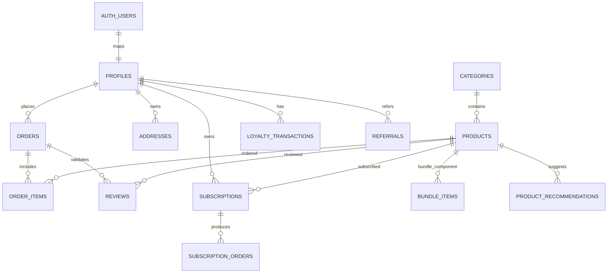

# DB_SCHEMA

Base cible : PostgreSQL Supabase, extension `vector` activée.

## 1) `categories`
Description : catégories de catalogue.

| Colonne | Type | Contraintes | Description |
|---|---|---|---|
| id | uuid | PK, default `gen_random_uuid()` | Identifiant |
| slug | text | UNIQUE, NOT NULL | Slug URL |
| name | text | NOT NULL | Nom catégorie |
| description | text | nullable | Description marketing |
| icon_name | text | nullable | Icône UI |
| image_url | text | nullable | Image catégorie |
| sort_order | int | NOT NULL, default 0 | Ordre affichage |
| is_active | boolean | NOT NULL, default true | Activation |
| created_at | timestamptz | NOT NULL, default now() | Création |

## 2) `products`
Description : catalogue produits, bundles, embeddings.

| Colonne | Type | Contraintes | Description |
|---|---|---|---|
| id | uuid | PK | ID produit |
| category_id | uuid | FK -> `categories.id`, NOT NULL | Catégorie |
| slug | text | UNIQUE, NOT NULL | Slug |
| name | text | NOT NULL | Nom |
| description | text | nullable | Description |
| price | numeric(10,2) | NOT NULL | Prix |
| stock_quantity | int | NOT NULL default 0 | Stock |
| is_available/is_featured/is_active/is_bundle | boolean | defaults | États métier |
| original_value | numeric(10,2) | nullable | Valeur bundle |
| attributes | jsonb | default `{}` | Métadonnées |
| sku | text | UNIQUE | Référence |
| embedding | vector(3072) | nullable | Embedding IA |
| created_at | timestamptz | default now() | Création |

## 3) `profiles`
Description : profil utilisateur app (lié à `auth.users`).

Colonnes clés : `id` (PK/FK vers `auth.users`), `full_name`, `phone`, `email`, `loyalty_points`, `is_admin`, `referral_code` (unique), `referred_by_id` (auto-référence), `created_at`.

## 4) `addresses`
Description : adresses de livraison utilisateur.

Colonnes clés : `id` (PK), `user_id` (FK -> `profiles.id`), `label`, `street`, `city`, `postal_code`, `country`, `is_default`, `created_at`.

## 5) `orders`
Description : commandes client/POS.

Colonnes clés : `id`, `user_id` (FK), `status`, `delivery_type`, `address_id` (FK), `subtotal`, `delivery_fee`, `total`, `loyalty_points_earned`, `loyalty_points_redeemed`, `promo_code`, `promo_discount`, `viva_order_code`, `payment_status`, `notes`, `created_at`.

## 6) `order_items`
Description : lignes de commande.

Colonnes clés : `id`, `order_id` (FK cascade), `product_id` (FK), `product_name`, `unit_price`, `quantity`, `total_price`.

## 7) `stock_movements`
Description : journal des mouvements de stock.

Colonnes clés : `id`, `product_id` (FK), `quantity_change`, `type`, `note`, `created_at`.

## 8) `store_settings`
Description : configuration globale (JSON).

Colonnes : `key` (PK), `value` (jsonb), `updated_at`.

## 9) `loyalty_transactions`
Description : transactions de points fidélité.

Colonnes clés : `id`, `user_id` (FK), `order_id` (FK nullable), `type` (`earned|redeemed|adjusted|expired`), `points`, `balance_after`, `note`, `created_at`.

## 10) `subscriptions`
Description : abonnements produits récurrents.

Colonnes clés : `id`, `user_id` (FK), `product_id` (FK), `quantity`, `frequency` (`weekly|biweekly|monthly`), `next_delivery_date`, `status` (`active|paused|cancelled`), `created_at`.

## 11) `subscription_orders`
Description : lien entre abonnement et commandes générées.

Colonnes : `id`, `subscription_id` (FK cascade), `order_id` (FK cascade), `created_at`.

## 12) `reviews`
Description : avis produits vérifiés.

Colonnes clés : `id`, `product_id` (FK), `user_id` (FK), `order_id` (FK), `rating` (1..5), `comment`, `is_verified`, `is_published`, `created_at`, contrainte unique (`product_id`,`user_id`,`order_id`).

## 13) `promo_codes`
Description : codes promo.

Colonnes clés : `id`, `code` (unique), `description`, `discount_type`, `discount_value`, `min_order_value`, `max_uses`, `uses_count`, `expires_at`, `is_active`, `created_at`.

## 14) `bundle_items`
Description : composants d'un bundle.

Colonnes : `id`, `bundle_id` (FK -> `products.id`), `product_id` (FK -> `products.id`), `quantity`, `created_at`, UNIQUE (`bundle_id`,`product_id`).

## 15) `product_recommendations`
Description : recommandations manuelles produit -> produit.

Colonnes : `id`, `product_id` (FK), `recommended_id` (FK), `sort_order`, `created_at`, UNIQUE (`product_id`,`recommended_id`), CHECK (`product_id <> recommended_id`).

## 16) `referrals`
Description : parrainage.

Colonnes : `id`, `referrer_id` (FK), `referee_id` (FK), `status` (`joined|completed`), `reward_issued`, `points_awarded`, `created_at`.

## 17) `pos_reports`
Description : clôtures/rapports POS journaliers.

Colonnes clés : `id`, `date` (UNIQUE), `total_sales`, `cash_total`, `card_total`, `mobile_total`, `items_sold`, `order_count`, `product_breakdown` (jsonb), `cash_counted`, `cash_difference`, `closed_at`, `closed_by` (FK), `created_at`.

## 18) `user_ai_preferences`
Description : préférences assistant IA par utilisateur.

Colonnes : `id`, `user_id` (FK unique), `goal`, `experience_level`, `preferred_format`, `budget_range`, `aroma_preferences` (text[]), `age_range`, `intensity_preference`, `extra_prefs` (jsonb), `updated_at`.

## 19) `assistant_interactions`
Description : historique interactions assistant.

Colonnes : `id`, `user_id` (FK), `session_id` (nullable), `interaction_type`, `quiz_answers` (jsonb), `recommended_products` (uuid[]), `clicked_product` (FK nullable), `feedback` (`positive|negative`), `created_at`, UNIQUE (`user_id`,`session_id`).

## 20) `user_active_sessions`
Description : suivi des sessions/appareils actifs.

Colonnes : `id`, `user_id` (FK), `device_id`, `device_name`, `user_agent`, `ip_address`, `last_seen`, `created_at`, `updated_at`, UNIQUE (`user_id`,`device_id`).

## Relations (principales)
- `products.category_id -> categories.id` (N:1)
- `orders.user_id -> profiles.id` (N:1)
- `order_items.order_id -> orders.id` (N:1)
- `reviews.product_id -> products.id` (N:1)
- `subscriptions.user_id -> profiles.id` (N:1)
- `subscription_orders.subscription_id -> subscriptions.id` (N:1)

## Index notables
- `idx_products_sku` sur `products(sku)`
- `idx_bundle_items_bundle_id` sur `bundle_items(bundle_id)`
- `idx_user_ai_extra_prefs` GIN sur `user_ai_preferences(extra_prefs)`
- `idx_user_active_sessions_user_last_seen` sur `user_active_sessions(user_id, last_seen desc)`

## Politiques RLS (Supabase)
- RLS activée sur toutes les tables métier.
- Lecture publique sur `categories`, `products`, `store_settings`.
- Écriture admin sur tables de gestion (`products`, `categories`, `promo_codes`, `product_recommendations`, etc.).
- Tables compte utilisateur restreintes au propriétaire (`addresses`, `user_active_sessions`, `user_ai_preferences`, `assistant_interactions`).
- Guard admin central via fonction SQL `public.is_admin()`.

## Diagramme ERD (Mermaid)

