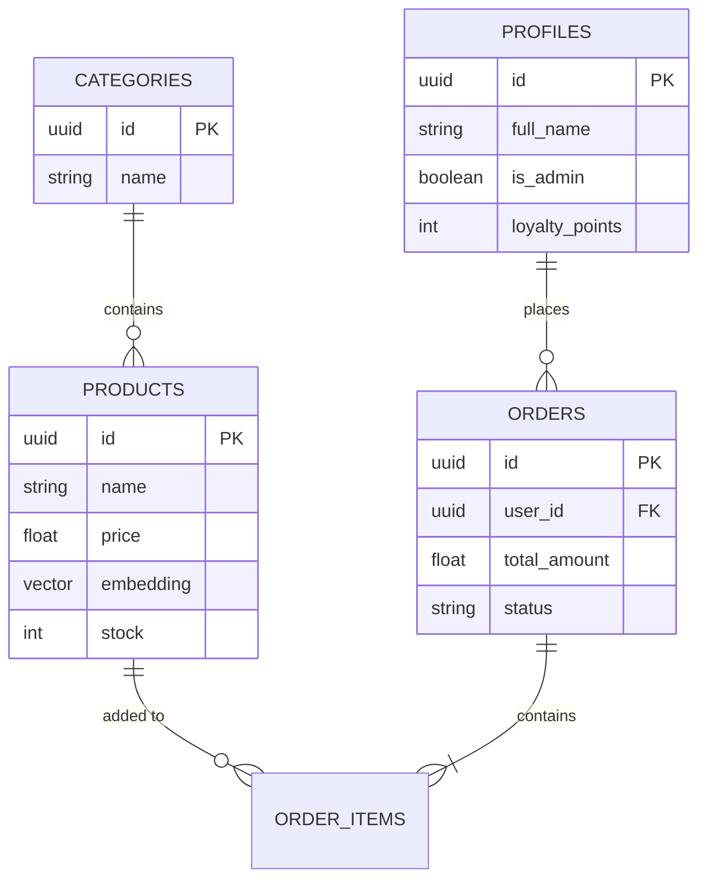

# Schéma de Base de Données (PostgreSQL / Supabase)

L'application repose sur un modèle relationnel, enrichi par la fonctionnalité `pgvector` pour la recherche sémantique.

## 📦 Tables Principales

### `profiles` (Utilisateurs & Permissions)
| Colonne | Type | Contrainte | Description |
| --- | --- | --- | --- |
| `id` | `uuid` | PK, Ref `auth.users(id)` | Identifiant utilisateur unique généré par l'Auth. |
| `full_name` | `text` | - | Nom complet du client. |
| `is_admin` | `boolean` | Défaut: `false` | Donne accès au dashboard admin. |
| `loyalty_points` | `integer`| Défaut: `0` | Solde des points de fidélité accumulés. |
| `referral_code` | `text` | Unique | Code unique pour parrainer de nouveaux clients. |

### `categories` (Catégories Catalogue)
| Colonne | Type | Contrainte | Description |
| --- | --- | --- | --- |
| `id` | `uuid` | PK | Identifant catégorie. |
| `name` | `text` | Non Null | Nom de la catégorie. |
| `description` | `text` | - | Rapide description (facultatif). |

### `products` (Catalogue Vente)
| Colonne | Type | Contrainte | Description |
| --- | --- | --- | --- |
| `id` | `uuid` | PK | Identifant produit |
| `name` | `text` | Non Null | Nom du produit |
| `price` | `numeric` | Non Null | Prix TTC actuel |
| `category_id` | `uuid` | FK `categories.id` | Lien vers la catégorie |
| `embedding` | `vector(768)`| - | Vecteur sémantique généré par OpenRouter pour IA |
| `stock` | `integer` | Défaut: `0` | Unités disponibles. |

### `orders` (Entête Commandes)
| Colonne | Type | Contrainte | Description |
| --- | --- | --- | --- |
| `id` | `uuid` | PK | Identifiant commande. |
| `user_id` | `uuid` | FK `profiles.id` | Client rattaché. |
| `total_amount` |`numeric` | Non Null | Montant total final de la commande. |
| `status` | `text` | Non Null | État: `pending`, `processing`, `completed`. |

### `order_items` (Lignes de Commande)
| Colonne | Type | Contrainte | Description |
| --- | --- | --- | --- |
| `id` | `uuid` | PK | Identifiant ligne. |
| `order_id`| `uuid` | FK `orders.id` | Rattaché à une commande. |
| `product_id`|`uuid` | FK `products.id` | Produit concerné. |
| `quantity`| `integer`| Non Null | Quantité achetée. |
| `unit_price`|`numeric` | Non Null | Snapchot du prix lors de l'achat. |

## 🔒 Sécurité (Row Level Security - RLS)
Supabase configure automatiquement des `Policies` pour restreindre l'accès :
- `profiles`: Lecture publique de son propre profil, écriture limitée.
- `products`: Lecture publique. Création/Modification/Suppression réservée à `is_admin = true`.
- `orders`: Un client ne peut `SELECT` que ses propres commandes. Les administrateurs peuvent tout lire.

## 📊 Diagramme Relationnel (ERD)

