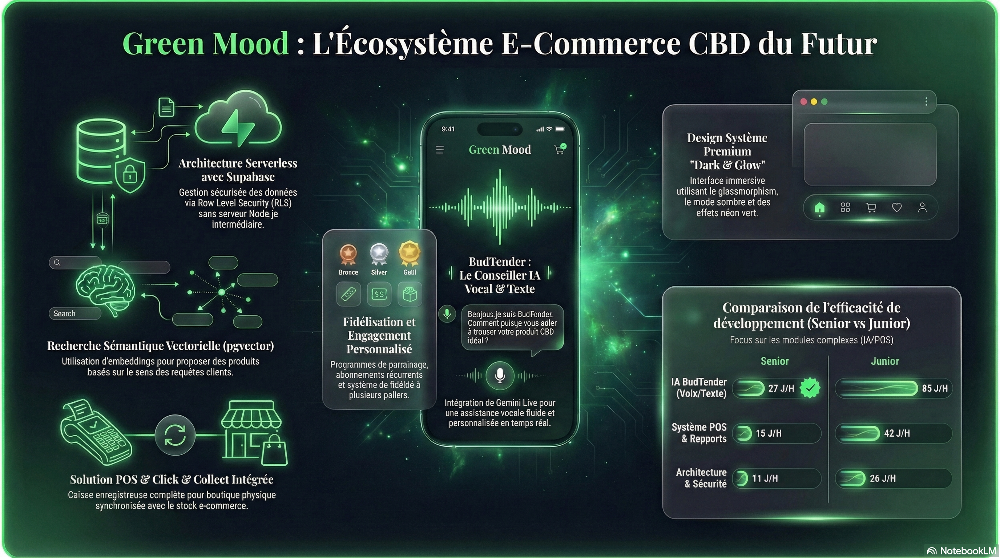

<p align="center">
  
</p>
<!-- <p align="center">
  
</p> -->

# Shop-ia 🍽️

[](https://vitejs.dev)
[](https://opensource.org/licenses/MIT)
[](https://react.dev)
[](https://www.typescriptlang.org)
[](https://tailwindcss.com)

> **Plateforme e-commerce intelligente pour les produits alimentaires du terroir**

Shop-ia est une solution e-commerce complète dédiée aux producteurs locaux et à la gastronomie artisanale, intégrant une IA conversationnelle (Shopia Assistant) pour guider les clients dans leur découverte de produits du terroir. Développée avec React, TypeScript et Supabase, elle offre une expérience d'achat personnalisée avec gestion de stocks, paiements sécurisés, programme de fidélité et parrainage.

---

## 📋 Table des matières

- [Pitch](#pitch)
- [Stack technique](#stack-technique)
- [Fonctionnalités](#fonctionnalités)
- [Prérequis](#prérequis)
- [Installation](#installation)
- [Configuration](#configuration)
- [Lancement](#lancement)
- [Structure du projet](#structure-du-projet)
- [Contribuer](#contribuer)
- [Licence](#licence)

---

## 🎯 Pitch

**Shop-ia** révolutionne l'expérience d'achat de produits alimentaires artisanaux en combinant :

- **Catalogue producteurs intelligent** avec recherche vectorielle et recommandations personnalisées
- **Assistant IA conversationnel** (Shopia) capable de conseiller les clients sur l'origine, la saisonnalité et les accords mets
- **Gestion omnicanale** : e-commerce, point de vente physique (POS), click & collect
- **Programme de fidélité** avec points cumulables et système de parrainage
- **Abonnements** pour les paniers récurrents (fromages, miels, huiles…)
- **Administration complète** avec analytics et gestion de stocks

---

## 🛠 Stack technique

| Technologie | Rôle | Version |
|-------------|------|---------|
| **React** | Framework UI | 19.0.0 |
| **TypeScript** | Langage principal | 5.8.2 |
| **Vite** | Build tool & dev server | 6.2.0 |
| **TailwindCSS** | Styling | 4.1.14 |
| **Supabase** | BaaS (Auth, DB, Realtime) | 2.98.0 |
| **Zustand** | State management | 5.0.11 |
| **React Router** | Routing | 7.13.1 |
| **Motion** | Animations | 12.23.24 |
| **Recharts** | Data visualization | 3.7.0 |
| **Lucide React** | Icon library | 0.546.0 |
| **Google GenAI** | AI integration | 1.29.0 |
| **Viva Wallet** | Payment processing | API |
| **OpenRouter** | LLM proxy (embeddings) | API |

---

## ✨ Fonctionnalités

### Pour les clients

| Fonctionnalité | Description |
|----------------|-------------|
| 🔍 **Recherche intelligente** | Recherche sémantique vectorielle avec embeddings |
| 🤖 **Shopia Assistant** | Conseiller IA avec quiz de préférences et chat |
| 🛒 **Panier persistant** | Synchronisation cross-device via Supabase |
| 📦 **Click & Collect** | Commande en ligne avec retrait au marché ou en boutique |
| 🚚 **Livraison** | Gestion des adresses et frais de port |
| 💳 **Paiement sécurisé** | Intégration Viva Wallet |
| 🎯 **Fidélité** | Points par achat, historique complet |
| 👥 **Parrainage** | Code personnel, bonus de bienvenue |
| 🔄 **Abonnements** | Panier récurrent (hebdomadaire, mensuel) |
| ⭐ **Avis vérifiés** | Système de notation post-achat |
| ❤️ **Favoris** | Liste de souhaits persistante |

### Pour les administrateurs

| Fonctionnalité | Description |
|----------------|-------------|
| 📊 **Dashboard** | Analytics temps réel (revenus, commandes, top produits) |
| 📦 **Gestion produits** | CRUD complet, stocks, bundles, images, Nutriscore |
| 📂 **Catégories** | Organisation par familles (boulangerie, fromages, miels…) |
| 🛍️ **Gestion commandes** | Workflow complet avec statuts |
| 📈 **Stock avancé** | Mouvements, alertes, historique |
| 👥 **Clients** | Profils, historique, actions administratives |
| 🎁 **Codes promo** | Réductions fixes ou en pourcentage |
| 🎯 **Marketing** | Configuration parrainage, bonus |
| 💬 **Assistant IA** | Analytics conversations, ajustement prompts |
| 🏪 **POS** | Point de vente physique avec affichage client |
| 🔐 **RLS** | Sécurité row-level dans Supabase |
| 🌾 **Import producteurs** | Import CSV, enrichissement IA, génération catalogue alimentaire |

---

## 📋 Prérequis

- **Node.js** >= 18.0
- **npm** >= 9.0
- **Compte Supabase** (https://supabase.com)
- **Clé API OpenRouter** (https://openrouter.ai)
- **Compte Viva Wallet** (https://developer.vivawallet.com) - pour les paiements
- **Clé API Gemini** (https://aistudio.google.com) - pour l'IA vocale

---

## 🚀 Installation

### 1. Cloner le repository

```bash
git clone https://github.com/moonback/Shop-ia.git
cd Shop-ia
```

### 2. Installer les dépendances

```bash
npm install
```

### 3. Configurer les variables d'environnement

```bash
cp .env.example .env
# Éditer .env avec vos clés API
```

### 4. Initialiser la base de données

Dans le dashboard Supabase → SQL Editor, exécuter :

```sql
-- Fichier : supabase/init_database.sql
\i supabase/init_database.sql
```

> **Note** : Les fichiers d'embeddings (`apply_vectors_part1.sql`, etc.) sont optionnels pour la recherche vectorielle.

---

## ⚙️ Configuration

### Variables d'environnement

| Variable | Description | Exemple | Obligatoire |
|----------|-------------|---------|-------------|
| `VITE_SUPABASE_URL` | URL de votre projet Supabase | `https://xxx.supabase.co` | ✅ |
| `VITE_SUPABASE_ANON_KEY` | Clé anonyme Supabase | `eyJ...` | ✅ |
| `VITE_OPENROUTER_API_KEY` | Clé API OpenRouter | `sk-or-...` | ✅ |
| `VITE_OPENROUTER_EMBED_MODEL` | Modèle d'embedding | `openai/text-embedding-3-small` | ❌ |
| `VITE_OPENROUTER_EMBED_DIMENSIONS` | Dimensions des vecteurs | `768` | ❌ |
| `VITE_VIVA_WALLET_BASE_URL` | URL API Viva Wallet | `https://demo.vivapayments.com` | ✅ |
| `VITE_VIVA_CLIENT_ID` | Client ID Viva Wallet | `xxx` | ✅ |
| `VITE_VIVA_CLIENT_SECRET` | Client Secret Viva Wallet | `xxx` | ✅ |
| `VITE_GEMINI_API_KEY` | Clé API Gemini (Live) | `xxx` | ❌ |

### Configuration Supabase

1. Activer l'authentification par email/mot de passe
2. Configurer les RLS policies (incluses dans `init_database.sql`)
3. Activer l'extension `vector` pour la recherche sémantique

---

## ▶️ Lancement

### Développement

```bash
npm run dev
# Application accessible sur http://localhost:3000
```

### Production

```bash
npm run build
npm run preview
```

### Déploiement (Vercel)

```bash
# Configurer vercel.json présent à la racine
vercel --prod
```

---

## 📁 Structure du projet

```
Shop-ia/
├── public/                 # Assets statiques
│   ├── images/
│   ├── examples/          # Fichiers d'exemple (CSV producteurs…)
│   ├── sw.js              # Service Worker
│   └── model-context.json  # Contexte IA
├── src/
│   ├── components/         # Composants React
│   │   ├── admin/         # Composants admin (30+ fichiers)
│   │   ├── shopia-assistant-ui/  # UI de l'assistant
│   │   ├── Layout.tsx     # Layout principal
│   │   ├── ShopiaAssistant.tsx   # Assistant IA
│   │   └── ...
│   ├── hooks/             # Custom hooks
│   │   ├── useShopiaAssistantChat.ts
│   │   ├── useShopiaAssistantMemory.ts
│   │   └── useGeminiLiveVoice.ts
│   ├── lib/               # Utilities & config
│   │   ├── supabase.ts    # Client Supabase
│   │   ├── types.ts       # Types TypeScript
│   │   ├── embeddings.ts  # Gestion embeddings
│   │   ├── generateFoodProducts.ts  # Catalogue alimentaire seed
│   │   └── shopiaAssistant*.ts  # Config IA
│   ├── pages/             # Pages (routing)
│   │   ├── Home.tsx
│   │   ├── Admin.tsx
│   │   ├── Catalog.tsx
│   │   ├── Checkout.tsx
│   │   └── ... (25+ pages)
│   ├── store/             # Zustand stores
│   │   ├── authStore.ts
│   │   ├── cartStore.ts
│   │   └── settingsStore.ts
│   ├── seo/               # SEO provider
│   ├── App.tsx            # App root
│   └── main.tsx           # Entry point
├── supabase/
│   ├── init_database.sql   # Schema complet
│   └── rescue_assistant_table.sql
├── docs/                  # Documentation produit
├── scripts/               # Scripts utilitaires
├── .env.example
├── package.json
├── tsconfig.json
├── vite.config.ts
└── vercel.json
```

---

## 🤝 Contribuer

Les contributions sont les bienvenues ! Voir [CONTRIBUTING.md](./CONTRIBUTING.md) pour les guidelines.

### Workflow rapide

1. Fork le projet
2. Créer une branche (`git checkout -b feature/xxx`)
3. Commit (`git commit -m "feat: xxx"`)
4. Push (`git push origin feature/xxx`)
5. Ouvrir une Pull Request

---

## 📄 Licence

Distribué sous licence MIT. Voir [LICENSE](./LICENSE) pour plus d'informations.

---

## 📚 Documentation additionnelle

- [ARCHITECTURE.md](./ARCHITECTURE.md) - Architecture système détaillée
- [API_DOCS.md](./API_DOCS.md) - Référence API
- [DB_SCHEMA.md](./DB_SCHEMA.md) - Schéma base de données
- [ROADMAP.md](./ROADMAP.md) - Feuille de route
- [CLAUDE.md](./CLAUDE.md) - Contexte pour assistants IA

---

## 🙏 Remerciements

- [Supabase](https://supabase.com) pour le backend-as-a-service
- [OpenRouter](https://openrouter.ai) pour l'accès aux LLM
- [Viva Wallet](https://vivawallet.com) pour le paiement
- [Google AI](https://aistudio.google.com) pour Gemini

---

<p align="center">
  Fait avec ❤️ par l'équipe Shop-ia
</p>
